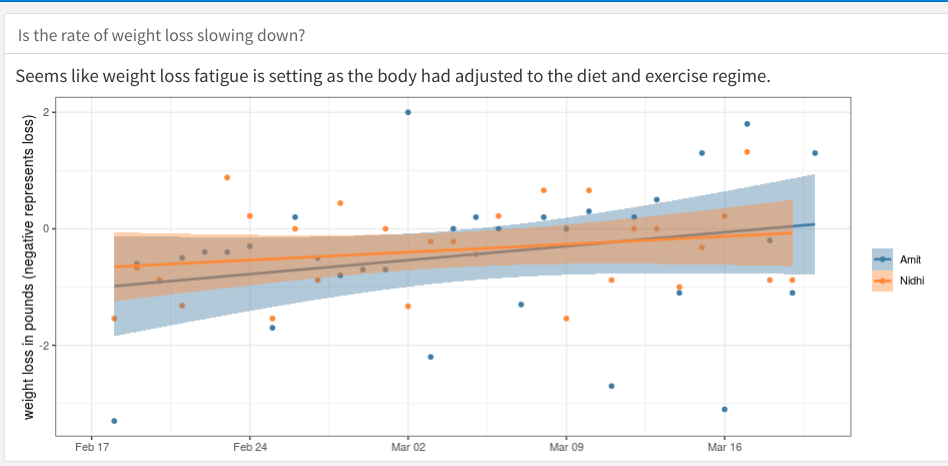

# Analyzing clean eating dataset
Data analysis for the 30day clean eating challenge. My wife and i did the clean eating challenge and recorded our weights, BMI and other metrics daily. I analyzed this dataset using R/Shiny. The Shiny dashboard is available [here](https://aa1603.shinyapps.io/clean-eating).

